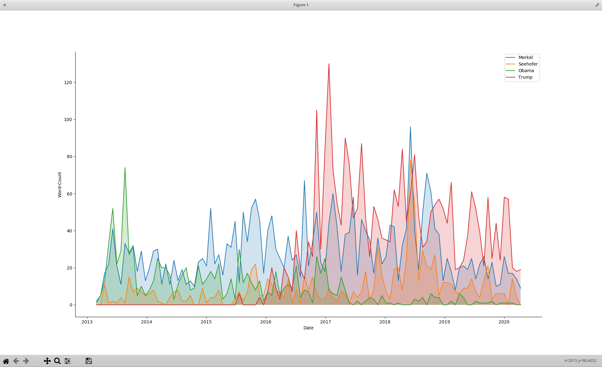

# Tagesschau Subtitle Word Occurrences

This repo enables the scraping, cleaning and analyzing of the subtitles of the tagesschau, the German daily news show.



The scraper `crawlerv2.py` scrapes show subtitles and show metadata from [tagesschau.de](tagesschau.de).  
The scripts `subtitle_file_to_text.py` and `clean_text.py` then parse and clean the text from the subtitle xml files.  
`clean_text_to_sql.py` takes the clean text data and creates a sqllite database to store all unique words and their occurrences per date.  
`word_frequency_plotter.py` finally uses matplotlib to plot the word occurrences over time.

## Installation
``` bash
pip3 install -r requirements.txt
```

## Usage
Crawl all subtitles
``` python
python3
> import crawlerv2.py
> crawlerv2.crawl_all()  # This will take some time!
```
Or just crawl today
```python3 crawlerv2.py```

Parse and clean data
```bash 
python3 subtitle_file_to_text.py
python3 clean_text.py
```

Finally create your word occurrence db
```python3 clean_text_to_sql.py```

You now can plot word occurrences over time by calling
```python3 word_frequency_plotter.py word1 word2 wordn```

## Inspiration

At the 36C3, the Chaos Communication Congress of the Chaos Computer Club e.V., the talk [Vom Ich zum Wir - Gesellschaftlicher Wandel in den Reden im Bundestag](https://media.ccc.de/v/36c3-10993-vom_ich_zum_wir) was held by maha and Kai Biermann. 

Tl;dw: They created [this tool](https://www.zeit.de/politik/deutschland/2019-09/bundestag-jubilaeum-70-jahre-parlament-reden-woerter-sprache-wandel), which makes a word occurrence analysis over time with the protocols of the German Bundestag.
